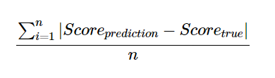

```{r setup, include=FALSE}
knitr::opts_chunk$set(echo = FALSE, warning = FALSE, message = FALSE)
library(tidyverse)
library(lubridate)
library(readr)
library(kableExtra)
library(janitor)
library(reshape2)
library(data.table)
library(ggplot2)
library(ggthemes)
library(gganimate)
library(ggcorrplot)
library(caret)
library(randomForest)
library(gam)
library(MASS)
library(car)
library(corpcor)
library(corrplot)
library(GGally)
library(scales)
library(Metrics)

```

"*Anime is an important part of our culture!*" \~ Ryota Mitarai from Danganronpa 3: The End of Hope's Peak High School


Indeed it is, Ryota. Indeed it is.

Anime, a term derived from the Japanese abbreviation of "animation," has become a significant part of global popular culture in recent decades. Its relevance in today's culture can be attributed to several factors, including its unique art style, diverse storytelling techniques, and the ability to explore complex themes.

Anime's storytelling techniques are diverse and encompass a wide range of genres and themes. Perhaps you've even heard of a few! From action-packed shonen series like "Dragon Ball" and "Naruto" to emotional dramas like "Your Lie in April" and "Clannad," there is an anime for **everyone** out there! Anime also explores genres beyond traditional boundaries, such as psychological thrillers ("Death Note"), science fiction ("Ghost in the Shell"), and fantasy ("Attack on Titan").

In recent years, the popularity of anime has skyrocketed, thanks to digital platforms and streaming services making it easily accessible to a global audience. Anime conventions and events draw massive crowds, showcasing the passion and enthusiasm of fans. The influence of anime has permeated various aspects of popular culture, including fashion, music, video games, and even Hollywood adaptations.

With dozens of new series being released each season, it's no surprised that fans and providers alike often wonder the age-old question: What makes an anime stick? What makes an anime go down in history like absolute titans (no pun intended) like Attack on Titan, Naruto, Bleach, Dragon Ball Z, and more?! And how do we know and keep track of how audiences are receiving this media?

Well, look no further! In comes [MyAnimeList.net](https://myanimelist.net/).

MyAnimeList.net (MAL) is an online platform dedicated to providing a comprehensive database and community-driven hub for anime and manga enthusiasts. Serving as a centralized resource, the website allows users to create personal profiles and maintain detailed lists of anime series, films, and manga they have consumed.

At its core, MyAnimeList.net offers a vast catalog of titles, encompassing a wide range of genres and themes. Users can search and explore the database to discover new anime and manga, while accessing essential information such as synopses, release dates, and production details.

The website also facilitates user engagement through its rating and review system, enabling community members to express their opinions on individual titles. This user-generated content fosters a vibrant environment for critical discourse, as well as the exchange of recommendations and insights.

## Data and Data Cleaning

We downloaded three [dataset housed on Kaggle](https://www.kaggle.com/datasets/hernan4444/anime-recommendation-database-2020?select=anime.csv) scraped between February 26th and March 20th containing information about 17,562 anime and the preference from 325,772 different users.

The `anime` dataset, which is the main dataset of interest detailed the core information of each anime listed.

We retained the following information from the `anime` dataset:

| Column        | Description                                                                                       |
|------------------------|------------------------------------------------|
| MAL_ID        | MyAnimelist ID of the anime. Unique for each anime.                                               |
| Name          | full name of the anime                                                                            |
| Score         | average score of the anime given from all users in the MyAnimelist database. Score out of 10 pts. |
| Genres        | comma separated list of genres for this anime. (e.g. Action, Adventure, Comedy, Drama, etc.)      |
| Type          | TV, movie, OVA, etc                                                                               |
| Episodes      | number of episodes                                                                                |
| Aired         | broadcast date (e.g. Apr 3, 1998 to Apr 24, 1999)                                                 |
| Studios       | comma separated list of studios                                                                   |
| Source        | Manga, Light novel, Book, etc.                                                                    |
| Duration      | duration of the anime per episode (e.g. 24 min. per ep.)                                          |
| Rating        | age rate (e.g. R - 17+ (violence & profanity))                                                    |
| Ranked        | ranking position based on the score (e.g 28))                                                     |
| Popularity    | position based on the number of users who have added the anime to their list                      |
| Members       | number of community members that are in this anime's "group"                                      |
| Favorites     | number of users who have the anime in their "favorites" list                                      |
| Watching      | number of users who have marked the anime as 'watching'                                           |
| Completed     | number of users who have marked the anime as 'completed'                                          |
| On-Hold       | number of users who have marked the anime as 'on-hold'                                            |
| Dropped       | number of users who have marked the anime as 'dropped'                                            |
| Plan to Watch | number of users who have marked the anime as 'plan to watch'                                      |

Additionally, we downloaded the `anime_with_synopsis` and the `rating_complete` data. The key information retained in the `anime_with_synopsis` data is the synopsis of each anime as recorded on the MyAnimeList.net site.

We left-joined the `anime` data with the `anime_with_synopsis` data to retain synopsis information on all anime that had synopsis information in the `anime` dataset.

The `rating_complete` data only considers anime that users have marked as 'completed'. It gives the `user_id`, `anime_id` as it corresponds to the MyAnimeList ID of the anime the user has rated, and the `rating` being the rating that the user has assigned to that particular anime that they have marked as completed. In order to synthesize this information, we aggregated the data by anime id and derived the average score given to each anime by users that have marked that anime as completed. This information was also left-joined to the dataset with the original anime data and synopsis data in order to retain the average score of each anime as according to users that have marked the anime as completed.

Thus, we have two more columns of interest in our dataset.

| Column          | Description                                                                                                                             |
|--------------------|----------------------------------------------------|
| Synopsis        | string with the synopsis of the anime                                                                                                   |
| Score_completed | average score of the anime given from users that have marked the anime as 'completed' in the MyAnimelist database. Score out of 10 pts. |

```{r}

anime_full_df <- read_csv("data/anime_df_full.csv") %>%
  dplyr::select(-c(...1)) 

```

```{r}

# genres

genre_vec <- unlist(strsplit(anime_full_df$genres, ", "))

genre_df <- as.data.frame(prop.table(table(genre_vec))) %>%
  filter(Freq >= 0.02)

keep_genres <- as.character(genre_df$genre_vec)

genres <- cbind(anime_full_df$mal_id, anime_full_df$genres, 
                as.data.frame(matrix(ncol = length(keep_genres), 
                     nrow = nrow(anime_full_df))))

colnames(genres) <- c("mal_id", "genres", keep_genres)

for (i in 1:length(keep_genres)){
  for (j in 1:nrow(genres)) {
  
  if (str_detect(genres[j, "genres"], keep_genres[i]) & !is.na(genres[j, "genres"])){
    genres[j, keep_genres[i]] <- 1
  }
    else{
      genres[j, keep_genres[i]] <- 0
    }
  }
}

```

```{r}

genres_use <- genres %>%
  dplyr::select(-genres)

```

```{r}

anime_full_df <- left_join(anime_full_df, genres_use)

```

```{r}

# aired

anime_full_df <- anime_full_df %>%
  tidyr::separate(aired, c("start_date", "end_date"), " to ")


anime_full_df$start_year <- str_sub(anime_full_df$start_date, -4, -1)
anime_full_df$end_year <- str_sub(anime_full_df$end_date, -4, -1)

```

```{r}
# studios

studio_vec <- unlist(strsplit(anime_full_df$studios, ", "))

#length(unique(studio_vec)) # 601 studios

studio_df <- as.data.frame(sort(table(studio_vec)), decreasing = T) %>%
  filter(Freq >= 40)
# retain studios with at least 40 anime

keep_studios <- as.character(studio_df$studio_vec)

# studios <- cbind(anime_full_df$mal_id, anime_full_df$studios,
#                 as.data.frame(matrix(ncol = length(keep_studios),
#                      nrow = nrow(anime_full_df))))
# 
# colnames(studios) <- c("mal_id", "studios", keep_studios)
# 
# for (i in 1:length(keep_studios)){
#   for (j in 1:nrow(studios)) {
# 
#   if (str_detect(studios[j, "studios"], keep_studios[i]) &
#       !is.na(studios[j, "studios"])){
#     studios[j, keep_studios[i]] <- 1
#   }
#     else{
#       studios[j, keep_studios[i]] <- 0
#     }
#   }
# }


```

```{r}

# studios_use <- studios %>%
#   select(-studios)

```

```{r}

# anime_full_df <- left_join(anime_full_df, genres_use)

```

```{r}
# retain info on top 2 animation studios
anime_full_df <- anime_full_df %>%
  separate(studios, c("studio1", "studio2", "studio3", "studio4"), ", ")

anime_full_df$num_studios <- rowSums(!is.na(anime_full_df[, c("studio1", "studio2", "studio3",
                                   "studio4")]), na.rm = T)


anime_full_df <- anime_full_df %>%
  dplyr::select(-c(studio3, studio4)) %>%
  mutate(studio1 = ifelse(studio1 %in% keep_studios, studio1,
                          ifelse(is.na(studio1), NA, "Other")),
         studio2 = ifelse(studio2 %in% keep_studios, studio2,
                          ifelse(is.na(studio2), NA, "Other")))

```

I first chose to reduce our analysis to only include anime with more than one episodes, so no movies, one-shots, or distinctive OVAs. We wanted to get information about anime series with continuous behavior, even if it was just a two-episode stint. This reduced our pool to 9,181 anime. Additionally, the `genres`, `aired`, and `studios` variables were reformatted for the purpose of analysis. \*Note: For genre, we retained information about genres that had a frequency of at least 2% of all the genres listed in the dataset.

All data cleaning was conducted using NumPy and Pandas in Python. The code for data cleaning can be found here.

```{r, include=FALSE}

anime_full_df <- anime_full_df %>%
  dplyr::select(-c(genres, start_date, end_date, duration)) 

anime_full_df <- anime_full_df %>%
  clean_names() %>%
  mutate(type = as.factor(type),
         studio1 = as.factor(studio1),
         studio2 = as.factor(studio2),
         source = as.factor(source),
         rating = as.factor(rating),
         action = as.factor(action),
         adventure = as.factor(adventure),
         comedy = as.factor(comedy),
         drama = as.factor(drama),
         fantasy = as.factor(fantasy),
         hentai = as.factor(hentai),
         historical = as.factor(historical),
         kids = as.factor(kids),
         magic = as.factor(magic),
         mecha = as.factor(mecha),
         romance = as.factor(romance),
         school = as.factor(school),
         sci_fi = as.factor(sci_fi),
         shounen = as.factor(shounen),
         slice_of_life = as.factor(slice_of_life),
         supernatural = as.factor(supernatural),
         start_year = as.numeric(start_year),
         end_year = as.numeric(end_year))


```

## Research Questions

There are a few questions that we hope to answer using this dataset.

1)  What features are most important to predicting the score of an anime?

2)  Do the scores of these anime differ based on all users vs. users that have that anime marked as completed?

3)  Is there an optimal number of episodes an anime should have to be scored well on MyAnimeList?

4)  Can the synopsis of an anime be a good indicator of anime ranking?

### The Pinnacle of Anime: What are the most important contributors to predicting the popularity (score) of an anime?

We start by checking for multicollinearity between our predictors of interest in order to reduce dimensionality and stabilize the variance of our estimated coefficients. Because of their direct relationship with the dependent variable of interest (score), we omit `ranked`, `popularity`, and `score_completed`

```{r}
anime_full_df <- as.data.frame(anime_full_df)

anime_full_mod_df <- anime_full_df %>%
  dplyr::select(-c(mal_id, name, sypnopsis, hentai, 
                   ranked, popularity, score_comp))

```

```{r}

corrplot(cor(select_if(na.omit(anime_full_mod_df %>% dplyr::select(-score)), 
                               is.numeric)))

```

Notably, number of members, favorites, watching, completed, on-hold, dropped, and plan to watch are moderately to highly correlated. In order to correct for this, we will retain number of community members in each anime's group as the representation of membership to the anime's fanbase in our dataset. Additionally, start year is highly correlated with end year so we'll just retain information on start year and instead create a variable representing number of years running.

```{r}

anime_full_mod_df_use <- anime_full_mod_df %>%
  dplyr::select(-c(favorites, watching, completed, on_hold, dropped, 
                   plan_to_watch)) %>%
  mutate(num_years_running = end_year - start_year) %>%
  dplyr::select(-end_year)

```

```{r}

corrplot(cor(select_if(na.omit(anime_full_mod_df_use), is.numeric)))


```

After removing the variables strongly correlated with number of variables, we have a better distribution of variables without unexpected multicollinearity. We move on to stepwise selection with these predictors as well as our non-numeric predictors to choose the best variables to model MyAnimeList score.

To recall, we retain the following variables as the subset of predictors to choose from: type, number of episodes, primary studio, secondary studio, source, rating, number of members in that anime's community, duration in minutes per episode, airing start year, number of animation studios working on the anime, and binary/indication variables for the following variables: Action, Adventure, Comedy, Drama, Fantasy, Historical, Kids, Magic, Mecha, Romance, School, Sci-Fi, Shounen, Slice of Life, and Supernatural.

In order to validate the generalizability, we will perform stepwise selection on 80% of our dataset, which we'll call the training data. The remaining 20% will be saved to test the accuracy of our model on.

After going through stepwise selection, we yield the following model:

*E[Score] = -14.4 + 0.0004Episodes + 0.16Rating~PG-13~ + 0.05Rating~PG~+ 0.22RatingR - 0.16Rating~R+~ - 0.21Rating~Rx~ + 0.000001Members + 0.02Duration + 0.02Action + 0.15Comedy + 0.31Drama + 0.26Historical + 0.06Magic + 0.04School + 0.28Shounen + 0.23Slice of Life + 0.01Start Year + 0.03Num. Years Running*

where $E[Score]$ is the expected value of the score of each anime.

```{r}
# ref group rating: G - All Ages
#unique(anime_full_mod_df_use$rating)

```

```{r}

set.seed(1)
row.number <- sample(1:nrow(anime_full_mod_df_use), 
                     0.8*nrow(anime_full_mod_df_use))
train = anime_full_mod_df_use[row.number,]
test = anime_full_mod_df_use[-row.number,]

#write_csv(train, "data/train.csv")
#write_csv(test, "data/test.csv")

```

```{r}

# Fit the full model 
full.model <- lm(score ~., data = na.omit(train))
# backwards regression model
step.model <- stepAIC(full.model, direction = "both", 
                      trace = FALSE)
#summary(step.model)


fin_mod <- lm(formula = score ~ episodes + rating + members + duration_mins + 
    action + comedy + drama + historical + magic + school + shounen + 
    slice_of_life + start_year + num_years_running, data = train)

summary(fin_mod)

# remove ranked, popularity, score_comp
```

So, what does this tell us? A few things actually. Among the anime in our training data, the more **episodes** that an anime has, the more likely it is to be scored highly on MAL. With each new additional episode in an anime, we expect a 0.0004 increase in score.

In regard to content ratings, we list the rating labels in order of highest to lowest scored, holding all other variables in our model constant:

1)  R - 17+ (violence & profanity)

2)  PG-13 - Teens 13 or older

3)  PG - Children

4)  G - All Ages

5)  R+ - Mild Nudity

6)  Rx - Hentai

Notably, there doesn't seem to be a linear relationship between rating and score. While generally audiences tend to like content that are on the maturer side (rated PG-13 and R - 17+), there's a limit to exactly *how* spicy audiences like their content to be cooked up for them. Particularly, as we see an upward trend in score from ratings G, PG, PG-13, and R- 17+, the next too more intense levels of content, R+ for mild nudity, and Rx for full blown Hentai are in fact scored the lowest on the list. Meaning, we mature themes seem to be a hit among the MAL community, but explicit content... not so much.


As expected, number of members in that anime's MAL group is positively associated with that anime's score. For every one additional member, we expect a 0.000001 increase in score, holding all other variables in the model constant. While this change seems small, it's helpful to keep in mind the range of values in each anime's group.

```{r}


ggplot(data = train, aes(x = members, y = score)) +
  geom_point() + geom_smooth() +  scale_x_continuous(labels = label_comma()) + 
  theme_economist() + labs(title = "Num. of Members vs.  MAL Score")


```

In our train dataset, the number of members within each anime's group ranges from 1 to 2,589,552 with a median value of 4,568 which is a *huge* range! This means, for example, we expect the score of an anime with a member base the size of the median value of 4,568 to increase by an estimated 0.005 (0.000001\*4,568 members) points.

```{r}

#summary(train$members)


# ggplot(aes(x = members), data = train) +
#   geom_histogram(bins = 100, fill = "light blue")  + 
#   scale_x_continuous(labels = label_comma()) + theme_economist()


```

```{python}
# !pip install pandas as pd
# !pip install numpy as np
# !pip install empiricaldist
# !pip install matplotlib
# !pip install scipy

```

Now let's talk duration per episode. Our model shows that there is a positive association between the number of episodes in a season, and the score of an anime. The more the merrier, one might say. With each additional minute per episode, the score is expected to increase by 0.02. Of course, the expectation of duration is different by type (e.g. TV, Movie, OVA).

```{r}


ggplot(data = train, aes(x = duration_mins, y = score,
                         col = type)) +
  geom_point() + geom_smooth() +  scale_x_continuous(labels = label_comma()) + 
  theme_economist() + labs(title = "Duration (mins.) vs.  MAL Score",
                           x = "Duration in minutes",
                           y = "Score")


```

Though, there's no hard and fast rules for how long these mediums can be, we see from the scatterplot above that while anime for TV typically tend to keep within 30 minutes or less, mediums like OVAs are more variable in their length (see scatterplot above). Additionally, specials, music videos, and ONAs tend to be shorter and movies tend to be longer.

```{python}

import pandas as pd
import numpy as np
from empiricaldist import Pmf
from matplotlib import pyplot as plt
import matplotlib.pyplot as plt


```

```{python}

# train = pd.read_csv('data/train.csv')
# 
# members_pmf = Pmf.from_seq(train['members'])
# 
# median_members = train['members'].median()
# 
# median_prob = members_pmf[median_members]
# 
# percentile_25th = train['members'].describe()['25%']
# 
# percentile_prob = members_pmf[percentile_25th]

```

```{python}

# fig, ax = plt.subplots(figsize = (12,6))
# 
# members_pmf.plot()
# 
# ax.set(xlabel = 'Num Members',
# ylabel = 'Frequency',
# title = 'The Probability of Each Membership Count Occuring Among Anime Groups')
# 
# # Annotate the median score
# ax.annotate(text=f'Median Members: {int(median_members)}',
#             xy=(median_members, median_prob),
#             xycoords='data',
#             fontsize=15,
#             xytext=(-350, 50),
#             textcoords='offset points', 
#             arrowprops={'color': 'red'})
# 
# # Annotate the 25th percentile
# ax.annotate(text=f'25th percentile: {int(percentile_25th)}',
#             xy=(percentile_25th, percentile_prob),
#             xycoords='data',
#             fontsize=15,
#             xytext=(-300, -75),
#             textcoords='offset points', 
#             arrowprops={'color': 'red'});

```

How about genre? Do some genres tend to be more well received than others, at least in regard to score?

Well, according to our model, these are the genres that are scored from highest to lowest on MyAnimeList.net in order, holding all other variables in our model constant:

1)  Drama

2)  Historical

3)  Shounen

4)  Slice of Life

5)  Comedy

6)  Magic

7)  School

8)  Action

Now, you may be wondering for example, \textit{how come action isn't ranked higher on this list?!} I mean, from My Hero Academia to Jujutsu Kaisen, it's no doubt that action anime encompass a huge portion of the hits right now. However... action is also the most frequently reported genre in 2020. So while it's a standout among the hits, in the grand scheme of things, while there are amazing action anime that are being ranked and perceived well, there are also action anime out there that are performing less favorably among crowds. In fact, it seems that the action genre may even be oversaturated with the good, the bad, and the ugly. In other words, purely slapping the genre of action on your anime doesn't make it an automatic hit. Yes, it's true. Audiences won't just froth at the mouth at characters going toe-to-toe in combat without it having that special 'umph' to it that really makes it a generational favorite.

**This just in, newer anime are in!** According to our model, with each additional year of an anime airing, we expect a score increase of 0.01. Of course, this may just be a consequence of recency bias and how anime are often more likely to be popular and perceived well in their prime (i.e. when they're still airing and fresh off the presses). But it's interesting to think how year-to-year advancements in animation and technology may have contributed to the perception of newer anime.

Additionally, we can take into account how many years an anime has been running. Evidently, anime that have been on-going for longer have significantly higher scores than those that have not. Perhaps being in the good graces of key audiences is what have allowed them to persist for so long. According to our model, with each additional year of runtime, the score value is expected to increase by 0.03.

```{r}
# var_imp_df <- data.frame(cbind(variable = rownames(var_imp), score = var_imp[,1]))
# var_imp_df$score <- as.double(var_imp_df$score)
# var_imp_df[order(var_imp_df$score,decreasing = TRUE),]

```

Now that we've summarized what our model is trying to tell us about the anime in our training set, we can apply our model to our withheld test set to see how well it performs on data it hasn't seen!

We'll use mean absolute error (MAE) as our measure of score prediction error, which is measured as such:

<center>

</center>


```{r}


pred <- predict(fin_mod, newdata = test)
rmse <- sqrt(sum((pred - test$score)^2, na.rm = T)/length(test$score[!is.na(test$score)]))
c(RMSE = rmse, R2=summary(fin_mod)$r.squared)

test_score_pred <- as.data.frame(cbind(score = test$score, pred)) %>%
  filter(!is.na(score), !is.na(pred))

mae(test_score_pred$score, test_score_pred$pred)


```

### Scores Galore: Do users preemptively score anime? Does the general consensus change from all users to users who have marked the anime as 'completed'?

Alright! We've talked about the key predictors of anime performance and to what magnitude these factors are expected to affect MAL score. We do well to recall that MAL score is averaged from scores assigned to anime from *all* users. A question of interest - does this averaged score significantly differ from the average score given only by users that have marked that anime as 'completed'? And if so, could this give us insight that users may preemptively score anime or that users that may score anime before seeing the whole thing may have held a different opinion if they had seen the whole thing through? Let's investigate.

Earlier, we were able to left-join information on scores given to anime by users that have marked those anime as 'completed' on MAL.

In order to test this, we may derive a vector of pairwise differences between the MAL score and the average score given by users that have indicated that they have completed the respective anime:

Score~MAL~ - Score~Completed~

If the scores are not significantly different, we may expect that this vector of differences follow a standard normal distribution with mean 0 and standard deviation 1 (i.e. N \~ (0, 1)).

```{r}


anime_full_df <- anime_full_df %>%
  mutate(score_diff = score - score_comp)

```

```{r}

#ggplot(data )


```

### How long is too long?

We've all heard the age-old qualm with some anime these days. Though fans alike love it when our favorite storylines and characters keep shoveling quality content into our trying lives, when is enough enough? Die hard fans can all name at least one show where they felt the story was dragged on and on when really, it would've just been optimal to end it several episodes or even seasons ago.

So, how long is too long? Is there an optimal range of episodes that an anime should be in order to leave the audience satisfied?
