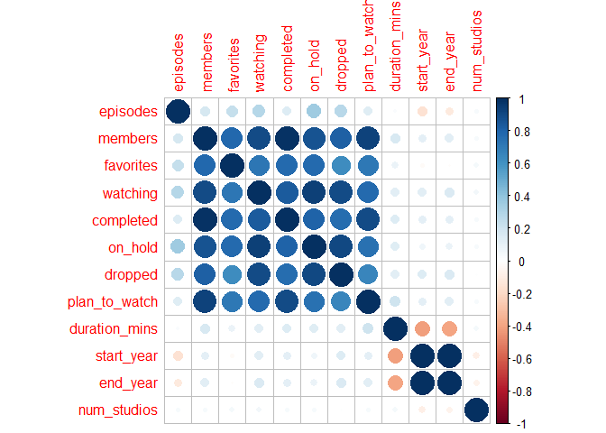
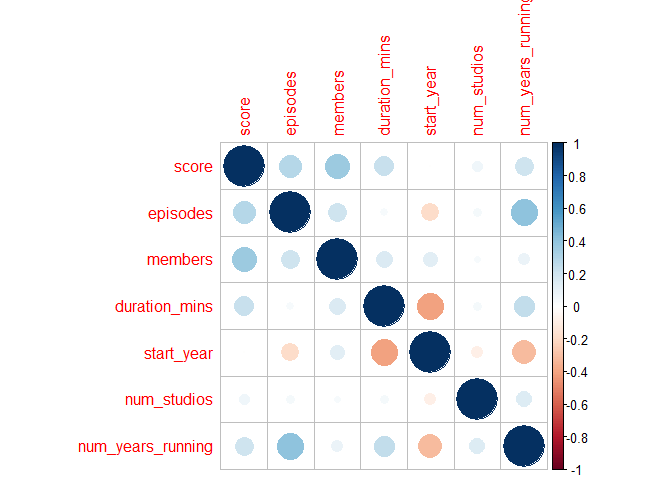
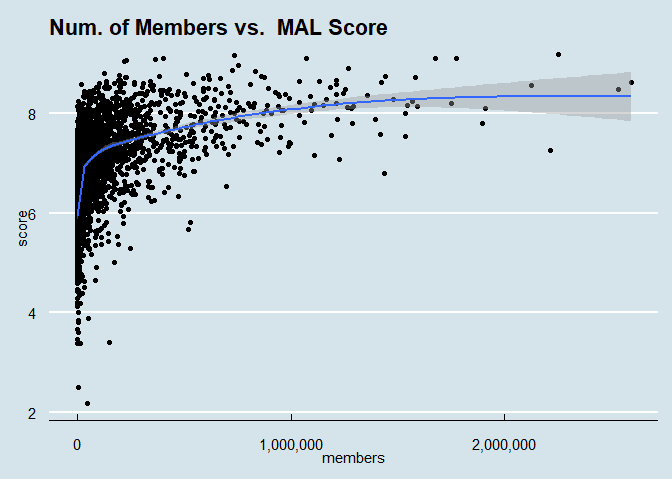
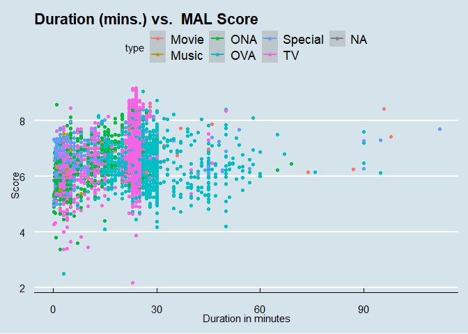
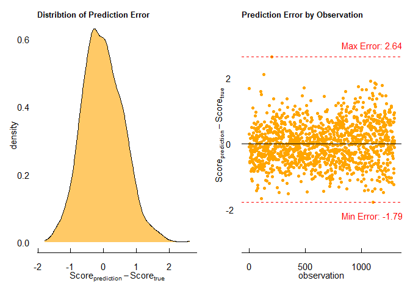

“*Anime is an important part of our culture!*” ~ Ryota Mitarai from
Danganronpa 3: The End of Hope’s Peak High School

Indeed it is, Ryota. Indeed it is.

Anime, a term derived from the Japanese abbreviation of “animation,” has
become a significant part of global popular culture in recent decades.
Its relevance in today’s culture can be attributed to several factors,
including its unique art style, diverse storytelling techniques, and the
ability to explore complex themes.

Anime’s storytelling techniques are diverse and encompass a wide range
of genres and themes. Perhaps you’ve even heard of a few! From
action-packed shonen series like “Dragon Ball” and “Naruto” to emotional
dramas like “Your Lie in April” and “Clannad,” there is an anime for
**everyone** out there! Anime also explores genres beyond traditional
boundaries, such as psychological thrillers (“Death Note”), science
fiction (“Ghost in the Shell”), and fantasy (“Attack on Titan”).

In recent years, the popularity of anime has skyrocketed, thanks to
digital platforms and streaming services making it easily accessible to
a global audience. Anime conventions and events draw massive crowds,
showcasing the passion and enthusiasm of fans. The influence of anime
has permeated various aspects of popular culture, including fashion,
music, video games, and even Hollywood adaptations.

With dozens of new series being released each season, it’s no surprised
that fans and providers alike often wonder the age-old question: What
makes an anime stick? What makes an anime go down in history like
absolute titans (no pun intended) like Attack on Titan, Naruto, Bleach,
Dragon Ball Z, and more?! And how do we know and keep track of how
audiences are receiving this media?

Well, look no further! In comes
[MyAnimeList.net](https://myanimelist.net/).

MyAnimeList.net (MAL) is an online platform dedicated to providing a
comprehensive database and community-driven hub for anime and manga
enthusiasts. Serving as a centralized resource, the website allows users
to create personal profiles and maintain detailed lists of anime series,
films, and manga they have consumed.

At its core, MyAnimeList.net offers a vast catalog of titles,
encompassing a wide range of genres and themes. Users can search and
explore the database to discover new anime and manga, while accessing
essential information such as synopses, release dates, and production
details.

The website also facilitates user engagement through its rating and
review system, enabling community members to express their opinions on
individual titles. This user-generated content fosters a vibrant
environment for critical discourse, as well as the exchange of
recommendations and insights.

## Data and Data Cleaning

We downloaded three [dataset housed on
Kaggle](https://www.kaggle.com/datasets/hernan4444/anime-recommendation-database-2020?select=anime.csv)
scraped between February 26th and March 20th containing information
about 17,562 anime and the preference from 325,772 different users.

The `anime` dataset, which is the main dataset of interest detailed the
core information of each anime listed.

We retained the following information from the `anime` dataset:

<table>
<colgroup>
<col style="width: 34%" />
<col style="width: 65%" />
</colgroup>
<thead>
<tr class="header">
<th>Column</th>
<th>Description</th>
</tr>
</thead>
<tbody>
<tr class="odd">
<td>MAL_ID</td>
<td>MyAnimelist ID of the anime. Unique for each anime.</td>
</tr>
<tr class="even">
<td>Name</td>
<td>full name of the anime</td>
</tr>
<tr class="odd">
<td>Score</td>
<td>average score of the anime given from all users in the MyAnimelist
database. Score out of 10 pts.</td>
</tr>
<tr class="even">
<td>Genres</td>
<td>comma separated list of genres for this anime. (e.g. Action,
Adventure, Comedy, Drama, etc.)</td>
</tr>
<tr class="odd">
<td>Type</td>
<td>TV, movie, OVA, etc</td>
</tr>
<tr class="even">
<td>Episodes</td>
<td>number of episodes</td>
</tr>
<tr class="odd">
<td>Aired</td>
<td>broadcast date (e.g. Apr 3, 1998 to Apr 24, 1999)</td>
</tr>
<tr class="even">
<td>Studios</td>
<td>comma separated list of studios</td>
</tr>
<tr class="odd">
<td>Source</td>
<td>Manga, Light novel, Book, etc.</td>
</tr>
<tr class="even">
<td>Duration</td>
<td>duration of the anime per episode (e.g. 24 min. per ep.)</td>
</tr>
<tr class="odd">
<td>Rating</td>
<td>age rate (e.g. R - 17+ (violence &amp; profanity))</td>
</tr>
<tr class="even">
<td>Ranked</td>
<td>ranking position based on the score (e.g 28))</td>
</tr>
<tr class="odd">
<td>Popularity</td>
<td>position based on the number of users who have added the anime to
their list</td>
</tr>
<tr class="even">
<td>Members</td>
<td>number of community members that are in this anime’s “group”</td>
</tr>
<tr class="odd">
<td>Favorites</td>
<td>number of users who have the anime in their “favorites” list</td>
</tr>
<tr class="even">
<td>Watching</td>
<td>number of users who have marked the anime as ‘watching’</td>
</tr>
<tr class="odd">
<td>Completed</td>
<td>number of users who have marked the anime as ‘completed’</td>
</tr>
<tr class="even">
<td>On-Hold</td>
<td>number of users who have marked the anime as ‘on-hold’</td>
</tr>
<tr class="odd">
<td>Dropped</td>
<td>number of users who have marked the anime as ‘dropped’</td>
</tr>
<tr class="even">
<td>Plan to Watch</td>
<td>number of users who have marked the anime as ‘plan to watch’</td>
</tr>
</tbody>
</table>

Additionally, we downloaded the `anime_with_synopsis` and the
`rating_complete` data. The key information retained in the
`anime_with_synopsis` data is the synopsis of each anime as recorded on
the MyAnimeList.net site.

We left-joined the `anime` data with the `anime_with_synopsis` data to
retain synopsis information on all anime that had synopsis information
in the `anime` dataset.

The `rating_complete` data only considers anime that users have marked
as ‘completed’. It gives the `user_id`, `anime_id` as it corresponds to
the MyAnimeList ID of the anime the user has rated, and the `rating`
being the rating that the user has assigned to that particular anime
that they have marked as completed. In order to synthesize this
information, we aggregated the data by anime id and derived the average
score given to each anime by users that have marked that anime as
completed. This information was also left-joined to the dataset with the
original anime data and synopsis data in order to retain the average
score of each anime as according to users that have marked the anime as
completed.

Thus, we have two more columns of interest in our dataset.

<table>
<colgroup>
<col style="width: 30%" />
<col style="width: 69%" />
</colgroup>
<thead>
<tr class="header">
<th>Column</th>
<th>Description</th>
</tr>
</thead>
<tbody>
<tr class="odd">
<td>Synopsis</td>
<td>string with the synopsis of the anime</td>
</tr>
<tr class="even">
<td>Score_completed</td>
<td>average score of the anime given from users that have marked the
anime as ‘completed’ in the MyAnimelist database. Score out of 10
pts.</td>
</tr>
</tbody>
</table>

I first chose to reduce our analysis to only include anime with more
than one episodes, so no movies, one-shots, or distinctive OVAs. We
wanted to get information about anime series with continuous behavior,
even if it was just a two-episode stint. This reduced our pool to 9,181
anime. Additionally, the `genres`, `aired`, and `studios` variables were
reformatted for the purpose of analysis. \*Note: For genre, we retained
information about genres that had a frequency of at least 2% of all the
genres listed in the dataset. This reformatting led to the addition of a
few more columns to make the data in the raw dataset more digestible:

<table>
<colgroup>
<col style="width: 16%" />
<col style="width: 83%" />
</colgroup>
<thead>
<tr class="header">
<th>Col1</th>
<th>Col2</th>
</tr>
</thead>
<tbody>
<tr class="odd">
<td>Multiple Indicator Genre Variables</td>
<td>indicator (0/1) variables for genres Action, Adventure, Comedy,
Drama, Fantasy, Hentai, Historical, Kids, Magic, Mecha, Romance, School,
Sci-Fi, Shounen, Slice of Life, Supernatural</td>
</tr>
<tr class="even">
<td>Start Year</td>
<td>the year the anime started airing</td>
</tr>
<tr class="odd">
<td>End Year</td>
<td>the year the anime ended airing - this value is NA is the anime is
currently airing</td>
</tr>
<tr class="even">
<td>Primary Studio</td>
<td>the first studio listed in the ‘studios’ variable</td>
</tr>
<tr class="odd">
<td>Secondary Studio</td>
<td>the second studio listed in the ‘studios’ variable</td>
</tr>
<tr class="even">
<td>Number of Studios</td>
<td>the number of studios working/that worked on the anime</td>
</tr>
</tbody>
</table>

All data cleaning was conducted using NumPy and Pandas in Python. The
code for data cleaning can be found here.

## Research Questions

There are a few questions that we hope to answer using this dataset.

1.  What features are most important to predicting the score of an
    anime?

2.  Do the scores of these anime differ based on all users vs. users
    that have that anime marked as completed?

3.  Is there an optimal number of episodes an anime should have to be
    scored well on MyAnimeList?

4.  Can the synopsis of an anime be a good indicator of anime ranking?

### The Pinnacle of Anime: What are the most important contributors to predicting the popularity (score) of an anime?

We start by checking for multicollinearity between our predictors of
interest in order to reduce dimensionality and stabilize the variance of
our estimated coefficients. Because of their direct relationship with
the dependent variable of interest (score), we omit `ranked`,
`popularity`, and `score_completed`

Notably, number of members, favorites, watching, completed, on-hold,
dropped, and plan to watch are moderately to highly correlated. In order
to correct for this, we will retain number of community members in each
anime’s group as the representation of membership to the anime’s fanbase
in our dataset. Additionally, start year is highly correlated with end
year so we’ll just retain information on start year and instead create a
variable representing number of years running.

After removing the variables strongly correlated with number of
variables, we have a better distribution of variables without unexpected
multicollinearity. We move on to stepwise selection with these
predictors as well as our non-numeric predictors to choose the best
variables to model MyAnimeList score.

To recall, we retain the following variables as the subset of predictors
to choose from: type, number of episodes, primary studio, secondary
studio, source, rating, number of members in that anime’s community,
duration in minutes per episode, airing start year, number of animation
studios working on the anime, and binary/indication variables for the
following variables: Action, Adventure, Comedy, Drama, Fantasy,
Historical, Kids, Magic, Mecha, Romance, School, Sci-Fi, Shounen, Slice
of Life, and Supernatural.

In order to validate the generalizability, we will perform stepwise
selection on 80% of our dataset, which we’ll call the training data. The
remaining 20% will be saved to test the accuracy of our model on.

After going through stepwise selection, we yield the following model:

*E\[Score\] = -14.4 + 0.0004Episodes + 0.16RatingPG-13 +
0.05RatingPG+ 0.22RatingR - 0.16RatingR+ -
0.21RatingRx + 0.000001Members + 0.02Duration + 0.02Action +
0.15Comedy + 0.31Drama + 0.26Historical + 0.06Magic + 0.04School +
0.28Shounen + 0.23Slice of Life + 0.01Start Year + 0.03Num. Years
Running*

where *E*\[*S**c**o**r**e*\] is the expected value of the score of each
anime.

    ## 
    ## Call:
    ## lm(formula = score ~ episodes + rating + members + duration_mins + 
    ##     action + comedy + drama + historical + magic + school + shounen + 
    ##     slice_of_life + start_year + num_years_running, data = train)
    ## 
    ## Residuals:
    ##     Min      1Q  Median      3Q     Max 
    ## -3.5290 -0.3887  0.0254  0.4292  1.8228 
    ## 
    ## Coefficients:
    ##                                        Estimate Std. Error t value Pr(>|t|)    
    ## (Intercept)                          -1.435e+01  1.973e+00  -7.271 4.10e-13 ***
    ## episodes                              3.973e-04  1.832e-04   2.169 0.030137 *  
    ## ratingPG-13 - Teens 13 or older       1.581e-01  3.079e-02   5.134 2.95e-07 ***
    ## ratingPG - Children                   5.012e-02  4.447e-02   1.127 0.259768    
    ## ratingR - 17+ (violence & profanity)  2.186e-01  4.212e-02   5.190 2.19e-07 ***
    ## ratingR+ - Mild Nudity               -1.615e-01  4.207e-02  -3.838 0.000126 ***
    ## ratingRx - Hentai                    -2.056e-01  4.048e-02  -5.078 3.95e-07 ***
    ## members                               1.348e-06  5.028e-08  26.804  < 2e-16 ***
    ## duration_mins                         1.640e-02  1.064e-03  15.421  < 2e-16 ***
    ## action1                               1.615e-02  2.269e-02   0.712 0.476548    
    ## comedy1                               1.481e-01  2.062e-02   7.184 7.77e-13 ***
    ## drama1                                3.114e-01  2.488e-02  12.514  < 2e-16 ***
    ## historical1                           2.626e-01  3.652e-02   7.190 7.43e-13 ***
    ## magic1                                6.428e-02  3.200e-02   2.009 0.044598 *  
    ## school1                               3.519e-02  2.608e-02   1.349 0.177276    
    ## shounen1                              2.779e-01  2.476e-02  11.224  < 2e-16 ***
    ## slice_of_life1                        2.273e-01  2.836e-02   8.015 1.36e-15 ***
    ## start_year                            1.011e-02  9.820e-04  10.298  < 2e-16 ***
    ## num_years_running                     3.291e-02  9.432e-03   3.489 0.000489 ***
    ## ---
    ## Signif. codes:  0 '***' 0.001 '**' 0.01 '*' 0.05 '.' 0.1 ' ' 1
    ## 
    ## Residual standard error: 0.6343 on 5078 degrees of freedom
    ##   (2247 observations deleted due to missingness)
    ## Multiple R-squared:  0.3634, Adjusted R-squared:  0.3612 
    ## F-statistic: 161.1 on 18 and 5078 DF,  p-value: < 2.2e-16

So, what does this tell us? A few things actually. Among the anime in
our training data, the more **episodes** that an anime has, the more
likely it is to be scored highly on MAL. With each new additional
episode in an anime, we expect a 0.0004 increase in score.

In regard to content ratings, we list the rating labels in order of
highest to lowest scored, holding all other variables in our model
constant:

1.  R - 17+ (violence & profanity)

2.  PG-13 - Teens 13 or older

3.  PG - Children

4.  G - All Ages

5.  R+ - Mild Nudity

6.  Rx - Hentai

Notably, there doesn’t seem to be a linear relationship between rating
and score. While generally audiences tend to like content that are on
the maturer side (rated PG-13 and R - 17+), there’s a limit to exactly
*how* spicy audiences like their content to be cooked up for them.
Particularly, as we see an upward trend in score from ratings G, PG,
PG-13, and R- 17+, the next too more intense levels of content, R+ for
mild nudity, and Rx for full blown Hentai are in fact scored the lowest
on the list. Meaning, we mature themes seem to be a hit among the MAL
community, but explicit content… not so much.

As expected, number of members in that anime’s MAL group is positively
associated with that anime’s score. For every one additional member, we
expect a 0.000001 increase in score, holding all other variables in the
model constant. While this change seems small, it’s helpful to keep in
mind the range of values in each anime’s group.

In our train dataset, the number of members within each anime’s group
ranges from 1 to 2,589,552 with a median value of 4,568 which is a
*huge* range! This means, for example, we expect the score of an anime
with a member base the size of the median value of 4,568 to increase by
an estimated 0.005 (0.000001\*4,568 members) points.

Now let’s talk duration per episode. Our model shows that there is a
positive association between the number of episodes in a season, and the
score of an anime. The more the merrier, one might say. With each
additional minute per episode, the score is expected to increase by
0.02. Of course, the expectation of duration is different by type
(e.g. TV, Movie, OVA).

Though, there’s no hard and fast rules for how long these mediums can
be, we see from the scatterplot above that while anime for TV typically
tend to keep within 30 minutes or less, mediums like OVAs are more
variable in their length (see scatterplot above). Additionally,
specials, music videos, and ONAs tend to be shorter and movies tend to
be longer.

How about genre? Do some genres tend to be more well received than
others, at least in regard to score?

Well, according to our model, these are the genres that are scored from
highest to lowest on MyAnimeList.net in order, holding all other
variables in our model constant:

1.  Drama

2.  Historical

3.  Shounen

4.  Slice of Life

5.  Comedy

6.  Magic

7.  School

8.  Action

Now, you may be wondering for example, I mean, from My Hero Academia to
Jujutsu Kaisen, it’s no doubt that action anime encompass a huge portion
of the hits right now. However… action is also the most frequently
reported genre in 2020. So while it’s a standout among the hits, in the
grand scheme of things, while there are amazing action anime that are
being ranked and perceived well, there are also action anime out there
that are performing less favorably among crowds. In fact, it seems that
the action genre may even be oversaturated with the good, the bad, and
the ugly. In other words, purely slapping the genre of action on your
anime doesn’t make it an automatic hit. Yes, it’s true. Audiences won’t
just froth at the mouth at characters going toe-to-toe in combat without
it having that special ‘umph’ to it that really makes it a generational
favorite.

**This just in, newer anime are in!** According to our model, with each
additional year of an anime airing, we expect a score increase of 0.01.
Of course, this may just be a consequence of recency bias and how anime
are often more likely to be popular and perceived well in their prime
(i.e. when they’re still airing and fresh off the presses). But it’s
interesting to think how year-to-year advancements in animation and
technology may have contributed to the perception of newer anime.

Additionally, we can take into account how many years an anime has been
running. Evidently, anime that have been on-going for longer have
significantly higher scores than those that have not. Perhaps being in
the good graces of key audiences is what have allowed them to persist
for so long. According to our model, with each additional year of
runtime, the score value is expected to increase by 0.03.

Now that we’ve summarized what our model is trying to tell us about the
anime in our training set, we can apply our model to our withheld test
set to see how well it performs on data it hasn’t seen!

We’ll use mean absolute error (MAE) as our measure of score prediction
error, which is measured as such:

    ##      RMSE        R2 
    ## 0.5957100 0.3634162

    ## [1] 0.4951631

We use our model to predict on our test data and collect prediction
error on each observation. The plot below shows that the distribution of
prediction errors seems to roughly normally distributed with a maximum
error observed of 2.64 and a minimum error of -1.79. To put things into
context, on a scale of 1-10, which is the scale of MAL score, an error
of 2.64 can be a gross overestimation of an anime’s score. This maximum
value seems to be an outlier though as the majority of prediction errors
hover around 0.

### Scores Galore: Do users preemptively score anime? Does the general consensus change from all users to users who have marked the anime as ‘completed’?

Alright! We’ve talked about the key predictors of anime performance and
to what magnitude these factors are expected to affect MAL score. We do
well to recall that MAL score is averaged from scores assigned to anime
from *all* users. A question of interest - does this averaged score
significantly differ from the average score given only by users that
have marked that anime as ‘completed’? And if so, could this give us
insight that users may preemptively score anime or that users that may
score anime before seeing the whole thing may have held a different
opinion if they had seen the whole thing through? Let’s investigate.

Earlier, we were able to left-join information on scores given to anime
by users that have marked those anime as ‘completed’ on MAL.

In order to test this, we may derive a vector of pairwise differences
between the MAL score and the average score given by users that have
indicated that they have completed the respective anime:

ScoreMAL - ScoreCompleted

If the scores are not significantly different, we may expect that this
vector of differences follow a standard normal distribution with mean 0
and standard deviation 1 (i.e. N ~ (0, 1)).

### How long is too long?

We’ve all heard the age-old qualm with some anime these days. Though
fans alike love it when our favorite storylines and characters keep
shoveling quality content into our trying lives, when is enough enough?
Die hard fans can all name at least one show where they felt the story
was dragged on and on when really, it would’ve just been optimal to end
it several episodes or even seasons ago.

So, how long is too long? Is there an optimal range of episodes that an
anime should be in order to leave the audience satisfied?
